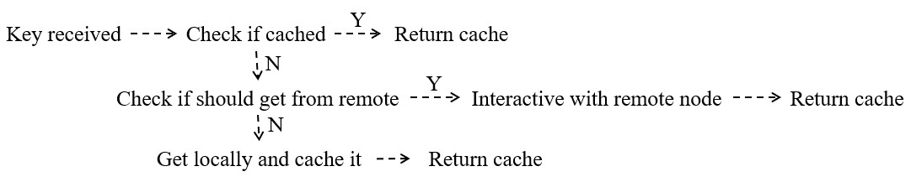

# GeeCache
My implementation of [geecache](https://github.com/geektutu/7days-golang) but with roughly complete unit test.
Still, slight difference exists in certain methods and functions.
 
The main workflow of it is like:

Further improvement of this demo may contain following points:
- Add more configurable cache implementation like LFU, FILO and unit all
these implementation with unified interface;
- More graceful handle of http;
 

More Information may be found in [golang/groupcache](https://github.com/golang/groupcache).
